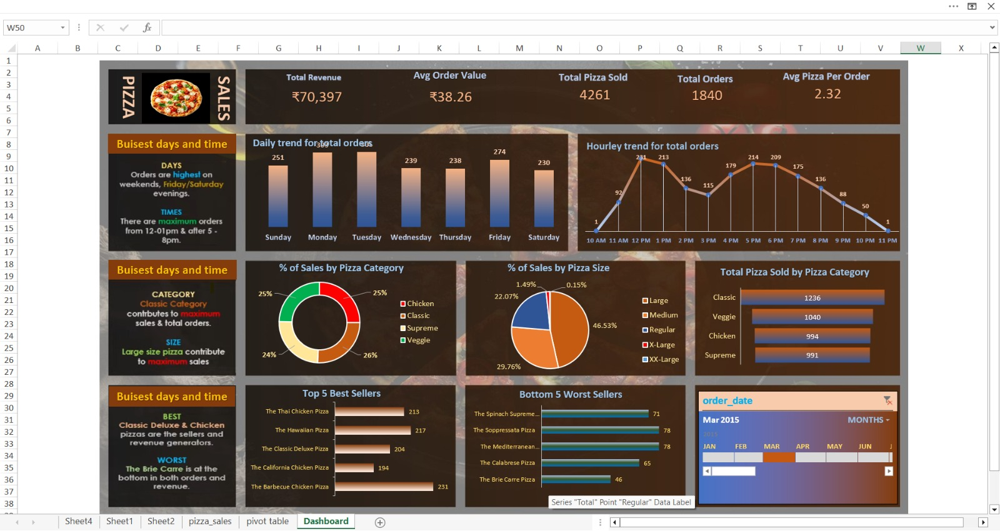

🍕 PizzaPulse Analytics

  

📊 Project Overview
Developed an end-to-end sales analytics dashboard focused on pizza sales performance. This project provides deep insights into customer ordering patterns, product performance, and revenue generation.

🔍 Key Insights & Analysis

💰 Monitored KPIs like Total Revenue, Total Orders, AOV, and Pizzas Sold

⏰ Analyzed hourly and daily order trends to identify peak hours

🏆 Identified Top 5 best-selling pizzas driving revenue

📉 Highlighted low-performing items for menu optimization

🍕 Compared sales by category and size

🛠️ Tools & Technologies

🗄️ SQL

📑 Excel

📊 Power BI

💡 Business Impact

📊 Helped optimize menu and pricing strategies

🕒 Improved operational efficiency during peak hours

📈 Increased revenue through data-driven decisions
